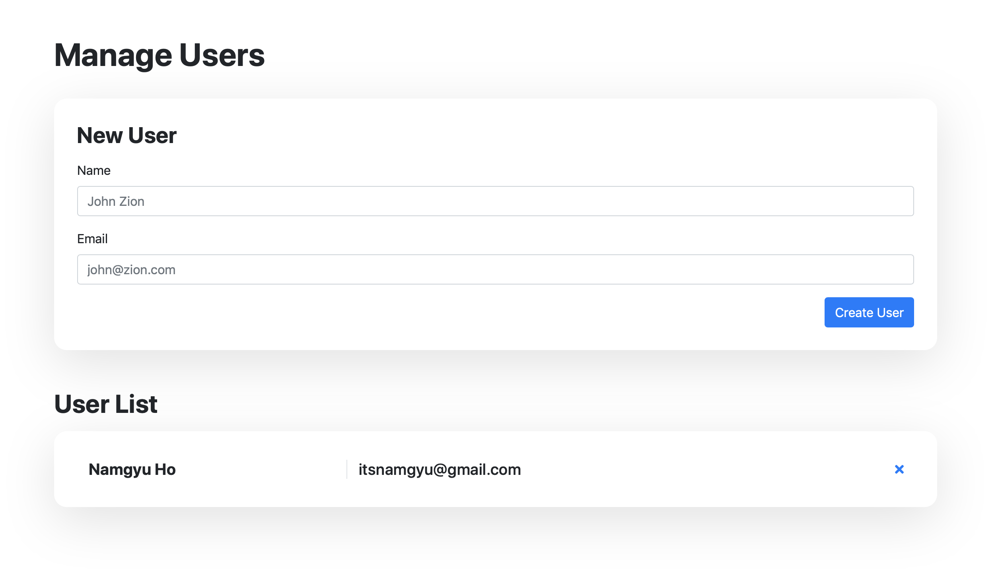

# rest-one
A REST API for a simple user model comprised of a `name` and an `email` address. Backend implemented using NodeJS from [this tutorial](https://www.tutorialspoint.com/nodejs/index.htm). Frontend console implemented using Backbone.js from [that tutorial](https://adrianmejia.com/blog/2012/09/11/backbone-dot-js-for-absolute-beginners-getting-started/).

## User API

#### GET /api/user/
Retrieve a list of existing users

#### POST /api/user/
Create a new user or overwrite an existing user

#### GET /api/user/:userID
Get user info

#### PUT /api/user/:userID
Edit (overwrite) an existing user (cannot create a new one)

#### DELETE /api/user/:userID
Delete an existing user

### Issues
- Need to tweak specifications of POST vs PUT
- Complete this doc...

## Console Screenshot

## Limitations
- JSON file based User database (DB is not an area of interest)
- Updating a model is not supported on the frontend, only the API.
- The backend does not manage primary keys. The index page simply generates a random id for each new user; to minimize DB implementation.
- Doesn't support authentication, communicating primary keys, etc.
